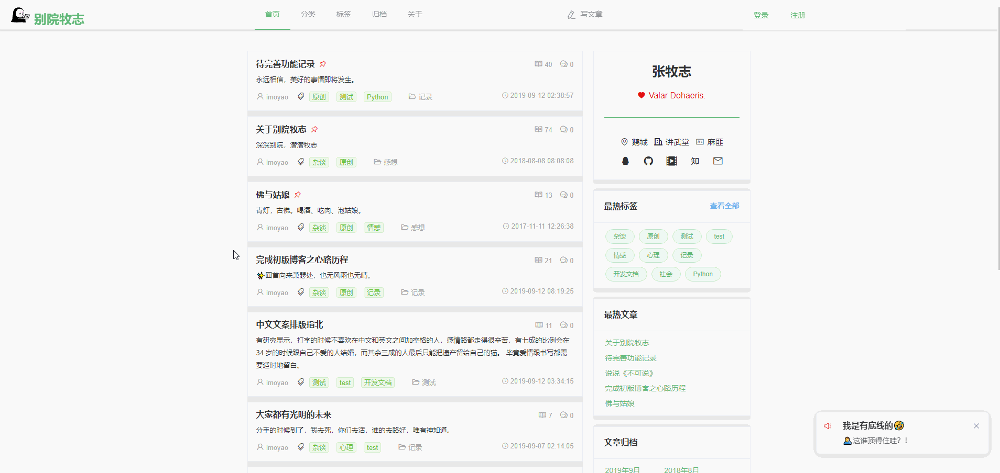
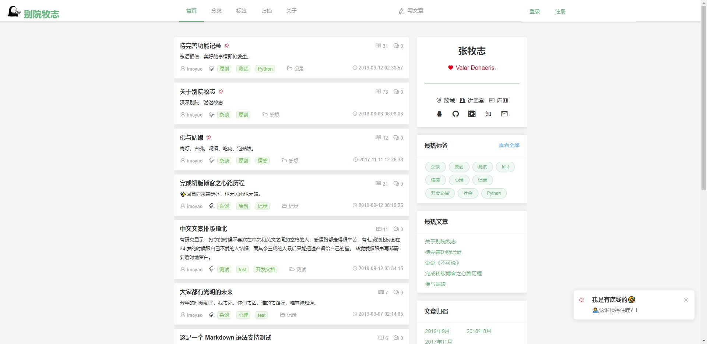
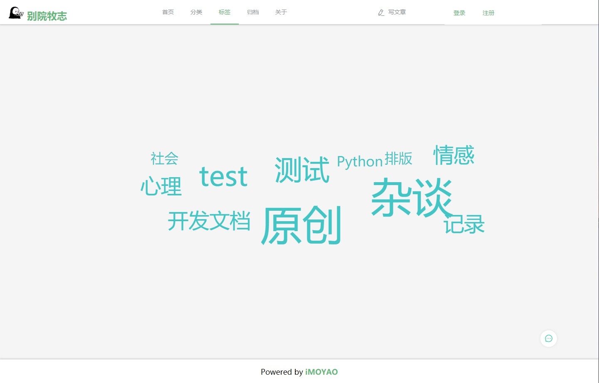
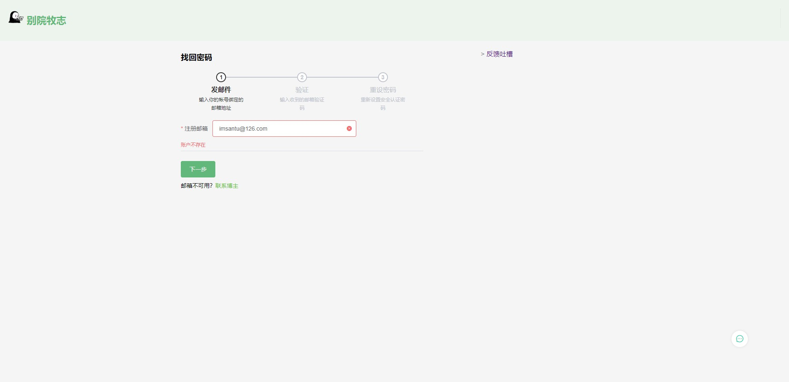

# IdealYard
[](https://github.com/996icu/996.ICU/blob/master/LICENSE)

使用 `Vue` 和 `Flask` 搭建前后端分离的 RESTful 个人博客。

关于该项目的部分说明可在此处找到👉[About IdealYard](https://masantu.com/categories/Projects/IdealYard/)，如果没有，有需要的请邮件或者 Issues 交流；

## ⚠ 注意
该博客仅用于学习原理，前端页面并**未实现**响应式布局，暂时也没有精力去实现，博客内容也没有时间去打理。关于日常的记录博客主要在[别院牧志](https://imoyao.github.io/)之中更新。 
## 前置条件  

### Python

3.6+

### MySQL

```bash
mysql  Ver 14.14 Distrib 5.7.26, for linux-glibc2.12 (x86_64) using  EditLine wrapper
```
或者

### MariaDB
```bash
[root@python]# mysql --version
mysql  Ver 15.1 Distrib 5.5.64-MariaDB, for Linux (x86_64) using readline 5.1
```
### 创建数据库

开发模式数据库：`iyblog_dev`，可以在[此处](back/config.py)修改配置

```sql
CREATE USER 'USERNAME'@'localhost' IDENTIFIED BY 'PASSWORD';
-- 如果需要支持emoji，则设置utf8mb4编码。否则使用utf-8编码即可
CREATE DATABASE DATABASENAME CHARSET=utf8mb4;
grant all privileges on DATABASENAME.* to USERNAME@localhost identified by 'PASSWORD';
flush privileges;
```
### 环境配置

1. 进入当前目录之后，先通过pip安装pipenv管理包
    ```bash
    pip install pipenv [--user]
    ```
2. 安装Python依赖
    ```bash
    pipenv install 
    ```
3. 配置环境变量
    ```bash
    vi .flaskenv
    ```
4. 编辑[dot.env](https://github.com/imoyao/idealyard/blob/master/dot.env)文件,配置环境变量并重命名为`.env`

    ```bash
    vi dot.env
    mv dot.env .env        # 参考 master 分支
    ```
## Docker 支持

pass

## TODO

因为时间关系，还有一些问题没有解决，详见[此处](./document/TODOlist.md)    
如果有同学需要`PR`，也可以参考此处已知未解决问题和`bug`单。

## 更多
与其在别处仰望,不如在这里并肩。 
开发模式配置及说明参见[更多文档](./document/deploy.md)

### 代码概览

目录结构和代码量统计参考[此处](./document/README.MD)  

### 前端概览    
  







## 致谢   

感谢 G 小姐[@Sabiner](https://github.com/Sabiner)的鼓励才会产生动手写个人博客的想法。一切缘起，都要从丘处机路过牛家村的那个下午说起……


同时感谢[@LeiWong](https://github.com/LeiWong)在开发中遇到问题帮助寻找`bug`并解决问题时付出的时间。 
  
---
> A human being should be able to change a diaper, plan an invasion, butcher a hog, conn a ship, design a building, write a sonnet, balance accounts, build a wall, set a bone, comfort the dying, take orders, give orders, cooperate, act alone, solve equations, analyze a new problem, pitch manure, program a computer, cook a tasty meal, fight efficiently, die gallantly. Specialization is for insects.
>
>一个人应该能够换尿布，
策划战争，
杀猪，
开船，
设计房子，
写十四行诗，
结算账户，
砌墙，
接脱臼的骨头，
安慰濒死的人，
服从命令，
发布命令，
携手合作，
独立行动，
解数学方程，
分析新问题，
铲粪，
电脑编程，
做出可口的饭，
善打架，
勇敢地死去。
只有昆虫才囿于一门。

-- 罗伯特·安森·海因莱因  《时间足够你爱》
